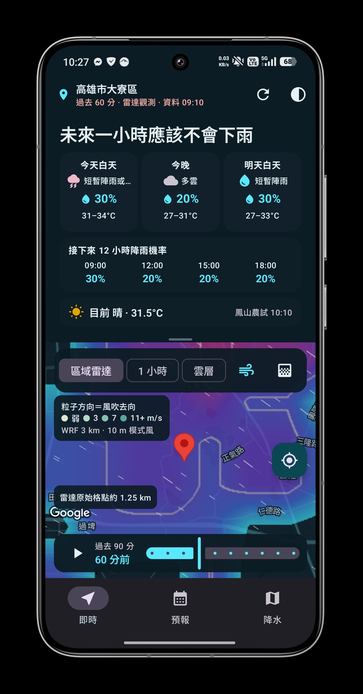
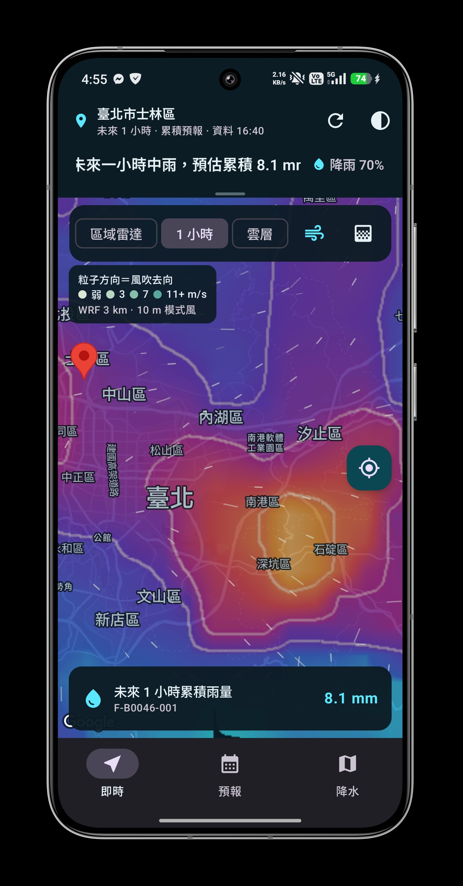
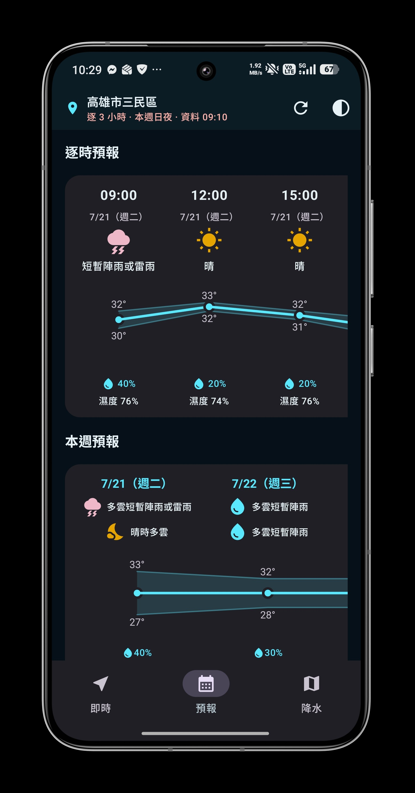
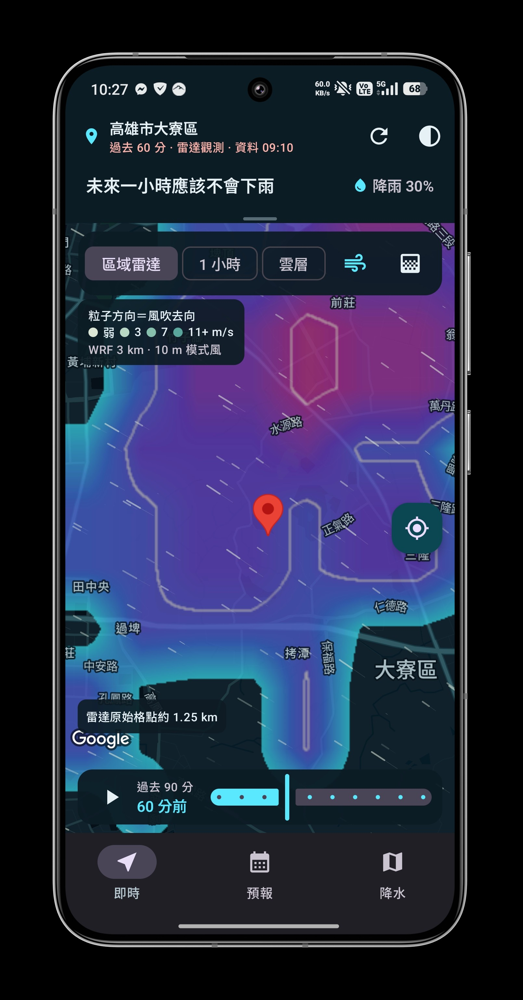
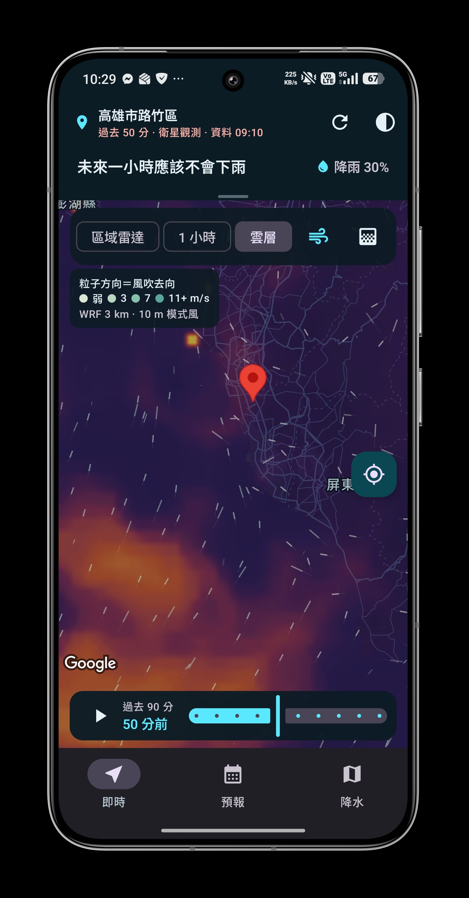
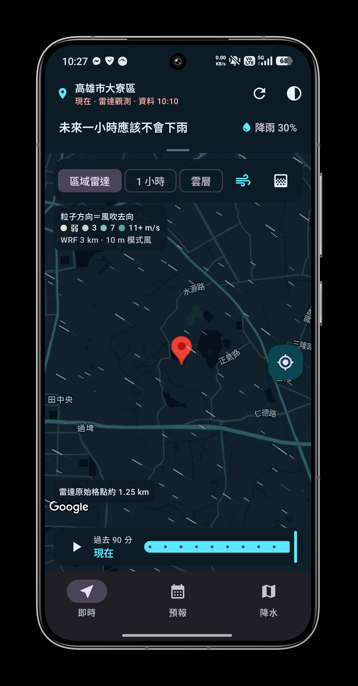
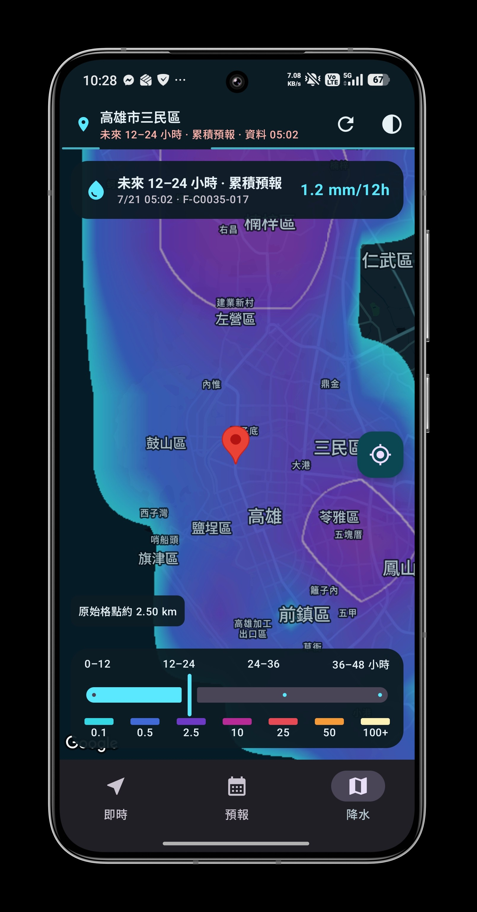

# How’s the Weather

出門前想知道會不會下雨，打開看一眼。

畫面上方有一句簡短的結論，下方是地圖。雨下在哪裡、往哪裡移動，可以在地圖上自己看。

Kotlin · Jetpack Compose · Material 3 · Google Maps · 中央氣象署開放資料

<table>
  <tr>
    <td width="33.33%" align="center">
      <br>
      <sub>先看結論</sub>
    </td>
    <td width="33.33%" align="center">
      <br>
      <sub>未來一小時雨量</sub>
    </td>
    <td width="33.33%" align="center">
      <br>
      <sub>逐時與一週預報</sub>
    </td>
  </tr>
</table>

## 怎麼用

- 預設地點是台北，授權定位後改為目前位置。長按地圖可以換一個地方。
- 拖曳中間的把手，調整摘要和地圖的比例；點一下則在三種高度之間切換。收到最小時，只留一行摘要和降雨機率。
- 地圖圖層有「降雨雷達」和「雲層 β」兩種，一次選一個。風場可以另外疊加。
- 時間軸可以回看過去 90 分鐘的雷達觀測，每 10 分鐘一格，也能切換到一小時與 0–48 小時的累積雨量預報。

<table>
  <tr>
    <td width="50%" align="center">
      <br>
      <sub>收合摘要，留給地圖</sub>
    </td>
    <td width="50%" align="center">
      <br>
      <sub>雲層與風場</sub>
    </td>
  </tr>
  <tr>
    <td width="50%" align="center">
      <br>
      <sub>回看雷達</sub>
    </td>
    <td width="50%" align="center">
      <br>
      <sub>12–24 小時累積雨量</sub>
    </td>
  </tr>
</table>

## 執行

1. 將 `local.properties.example` 複製為 `local.properties`，保留原本的 `sdk.dir`。
2. 填入以下金鑰：
   - `MAPS_API_KEY`：Google Maps。
   - `MAP_ID`：選填，使用 Cloud Styling 時才需要。
   - `CWA_API_KEY`：中央氣象署開放資料。
   - `MOENV_API_KEY`：選填，用於目前的空氣品質。
3. 用 Android Studio 開啟專案，執行 `app`。

沒有 `CWA_API_KEY` 或下載失敗時，會改用示範資料。

### 底圖切換

底圖在建置時決定，App 內沒有切換開關。在 `local.properties` 設定後重新建置即可：

```properties
MAP_PROVIDER=google   # 預設，需要 MAPS_API_KEY
MAP_PROVIDER=osm      # OpenStreetMap（osmdroid），不需金鑰
```

`osm` 預設使用 CARTO Positron／Dark Matter 圖磚（OpenStreetMap 資料），淺色與深色主題各自對應。可用 `OSM_TILE_URL_LIGHT`、`OSM_TILE_URL_DARK` 改成其他 `{z}/{x}/{y}` 圖磚網址（`{s}` 為 a–d 子網域，`{r}` 為 `@2x`），並以 `OSM_TILE_ATTRIBUTION` 設定對應的版權標示（`local.properties` 以 ISO-8859-1 讀取，`©` 等非 ASCII 字元請寫成 `\u00A9`）。CARTO 免費圖磚僅限非商業用途。

## 資料來源

| 代碼 | 內容 |
| --- | --- |
| `F-B0046-001` | 未來一小時累積雨量格點 |
| `O-A0058-005` / `O-A0058-006` | 雷達回波（大範圍／局部） |
| `O-B0032-003` / `O-C0042-004` | 紅外線衛星雲圖（東亞／台灣） |
| `O-A0001-001` | 測站風場觀測 |
| `F-D0047-*` | 鄉鎮三天與一週預報 |
| `AQX_P_432` | 環境部空氣品質觀測 |

## 程式結構

- `domain/`：天氣格點與判斷規則
- `data/`：資料下載、快取與解析
- `render/`：地圖圖磚、色階與等值線
- `ui/`：主畫面

## 測試

```powershell
$env:JAVA_HOME='C:\Program Files\Android\Android Studio\jbr'
./gradlew.bat :app:testDebugUnitTest :app:assembleDebug :app:lintDebug --console=plain
```
